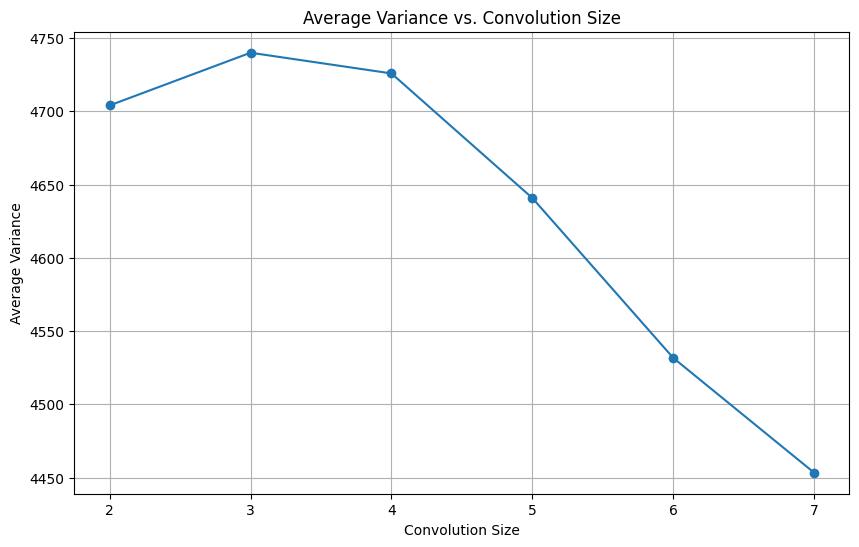
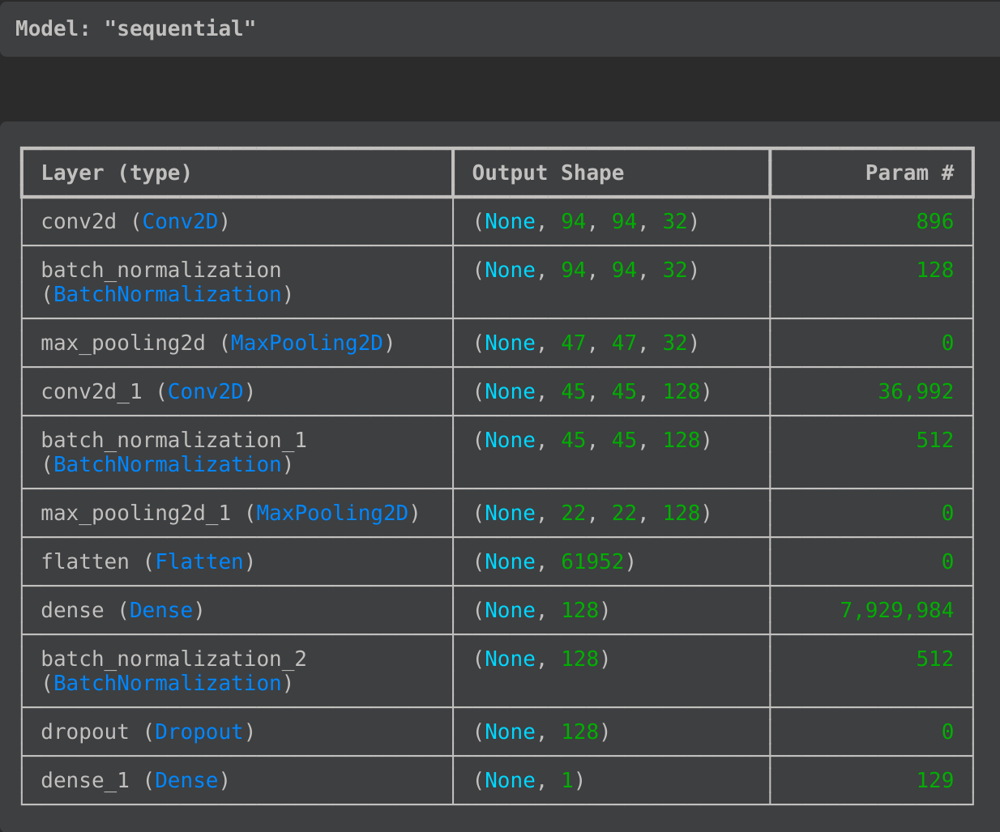
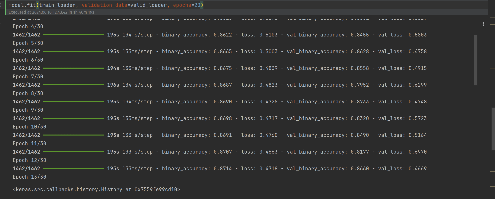
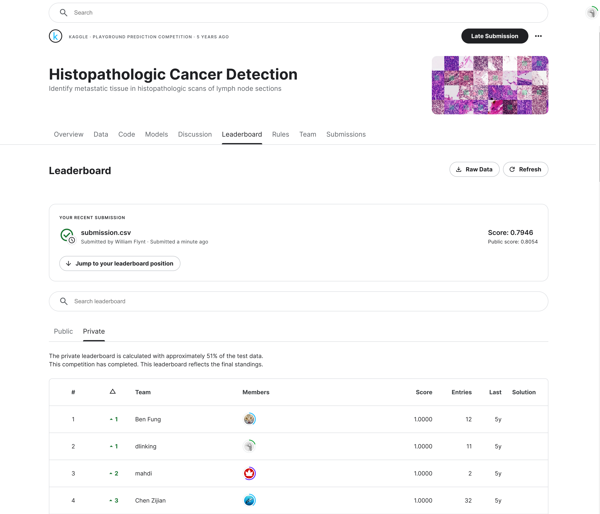

# CNN Cancer Detection Kaggle Mini-Project

https://www.kaggle.com/c/histopathologic-cancer-detection

## Notebook

[histopathologic-cancer-detection.ipynb](histopathologic-cancer-detection.ipynb)

## Highlights

A few discussion points for the training.

### Selecting Convolution Size

EDA included some measure of variance between convolution sizes. 
In the end, I picked a `3x3` size - pretty standard.

### Model

I went through several versions of model, but all were variants of a sequential with `Conv2D` and `Dense` layers.

I experimented with SGD and Adam/AdamW optimizers, as well as various image transforms. Here is the end model:

### Training

When I reached my final architecture (mostly for time), I train on all the data.
The model converged after fewer than 15 epochs.

### Future Work

Others on Kaggle were extremely accurate - 100% scores!
My work was just under 80%.

I think I could preprocess my images first.
I would also look to implement some other well-known CNN architectures.
